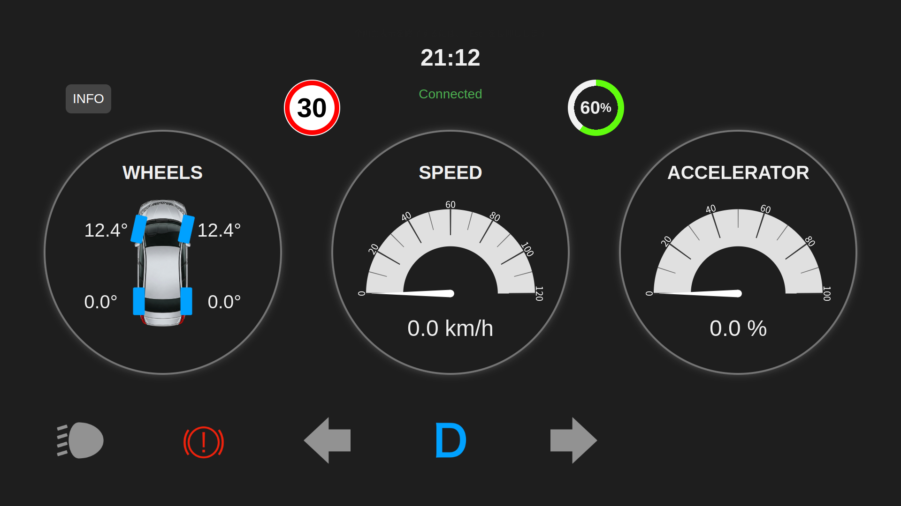
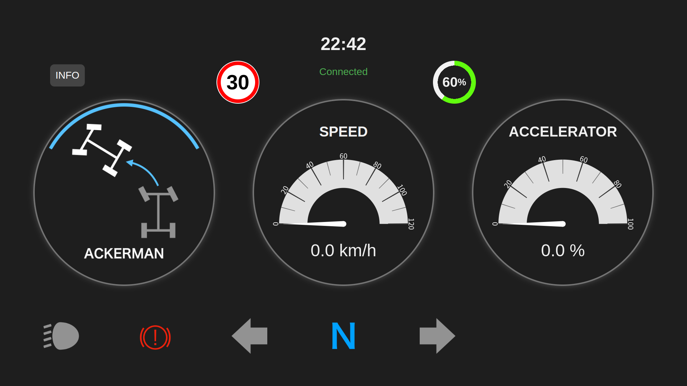

# pixkit_dashboard

PIX Moving社の自動運転EV **PIXKIT3.0** の車両情報（速度・アクセル・ランプ点灯など）をリアルタイムに可視化する**メータープログラム**です。車両とAutowareとの間でやり取りされるROS2トピックから各種情報を取得して表示しています。



---

## ✅ 表示情報

#### 常時表示項目
- 時刻
- フロントエンドとバックエンドの接続状況
- 制限速度 (コントローラーで設定)
- バッテリー残量
- 速度
- アクセル開度
- ヘッドライト点灯
- 左ウインカー点灯
- 右ウインカー点灯
- 電動パーキングブレーキ状態
- ギア (D / N / R)
- 制御モード (車内ハンドル / コントローラー / 自動運転)
- 緊急停止
#### 切り替え表示項目
- タイヤ角 (4輪それぞれ)
- ステアリングモード
- バックカメラ (ギアR時に自動表示)

---

## 🔧 動作環境

- PIXKIT 3.0
- Ubuntu 22.04
- ROS 2 Humble
- Google Chrome
- メーター表示用モニター (1920×1080)  
- Webカメラ (バックカメラ映像用)

---

## 🖥️ 使用技術

#### バックエンド (pixkit_dashboard.py)
- Flask
- SocketIO
- [pix_driver](https://github.com/pixmoving-moveit/pix_driver)
#### フロントエンド (index.html)
- HTML/CSS/JavaScript
- Gauge.js
- Socket.IO

---

## 📁 構成

### pixkit_dashboard.py
ROS2トピック・Webカメラ画像を取得して情報をWebSocketサーバーで配信する
### index.html
Socket.IO でリアルタイムに更新しながらメーターを描画する
### run_dashboard.py
自動で pixkit_dashboard.py 実行後に Google Chrome で UIページをメーター用モニターに全画面表示を行う

---

## 📦 インストール

```bash
cd ~/ros2_ws/src

# 車両情報のトピックを取り扱うためにpix_driverをインストール
git clone https://github.com/pixmoving-moveit/pix_driver.git

# 本リポジトリを追加
git clone https://github.com/iASL-Gifu/pixkit_dashboard.git

cd ~/ros2_ws

# 依存パッケージのインストール
pip install -r requirements.txt

colcon build --packages-select pix_driver pixkit_dashboard

source install/setup.bash
```

---

## 🚀 起動方法

### 1. Webカメラの接続
- Webカメラを車載PCに接続する。

### 2. モニターの接続
1. Ubuntu設定の `ディスプレイ設定` を開く。  
2. ディスプレイモードを `画面を拡張`モード に設定する。  
3. PCの標準画面をプライマリーディスプレイに設定する。  
4. 接続したメーター用モニター[ 2 ] を 主ディスプレイ[ 1 ] の左側に配置する。  
5. 以上の設定を適用する。

### 3. Autowareの実行
- Autowareを起動する。

### 4. プログラムの実行
```bash
cd ~/ros2_ws/src/pixkit_dashboard/pixkit_dashboard

ros2 run python run_dashboard.py
```

### 5. 終了
- `Ctrl + C` で全プロセスが正常に終了する。

---

## 💡 トラブルシューティング

実行に問題がある場合は、下記の起動手順をお試し下さい。

### 1~3. 機器の接続〜Autowareの実行
- 前項の起動方法と同様

### 4. プログラムの実行
```bash
cd ~/ros2_ws/src/pixkit_dashboard/pixkit_dashboard

ros2 run python pixkit_dashboard.py
```

### 5. WebブラウザでUIページに接続
1. 任意のWebブラウザを起動する。  
2. アドレスバーに `localhost:5001` と入力してアクセスする。  

🌟 ブラウザの全画面表示機能をOnにすると適切なレイアウトでUIが表示されます。




---

## 👤 開発者

#### 岐阜大学 工学部 アレックス研究室 (iASL)
- Site: https://www.iasl.info.gifu-u.ac.jp/  
- Github: https://github.com/iASL-Gifu/

---

## ライセンス

本プロジェクトは Apache License 2.0 の下でライセンスされています。  
詳細は [LICENSE](./LICENSE) ファイルをご覧ください。

### Apache License 2.0（概要）

このライセンスの下では、以下のことが許可されています：

- 商用利用
- 修正
- 配布
- 特許使用
- 私的使用

ただし、以下の義務があります：

- 元のライセンス文の保持（著作権表示とライセンスの明記）
- 改変の有無を記載
- 商標の使用制限

このライセンスは「現状のまま（AS IS）」で提供されており、  
いかなる保証もなく、作者は一切の責任を負いません。

